## 下载

下载资源：[链接][https://mirrors.tuna.tsinghua.edu.cn/qt/official_releases/online_installers/]

在下载目录打开命令行，输入

```bat
文件名 --mirror https://mirrors.tuna.tsinghua.edu.cn/qt
```

部分用户下载时可能出现`403 Forbidden`，可以更换镜像源至

``` bat
文件名 --mirror http://mirrors.ustc.edu.cn/qtproject/
```

*PS：硬盘空间一定要够，所有组件下载后共计300多GB*

*PS：Qt打开比较慢。*

## 创建文件

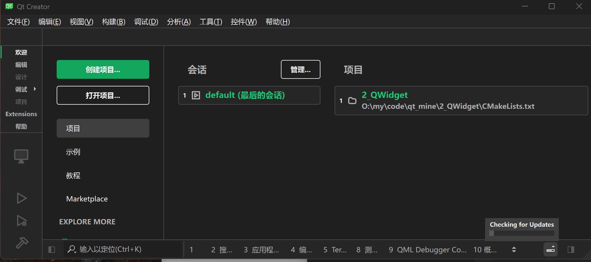

1.点击`创建项目`

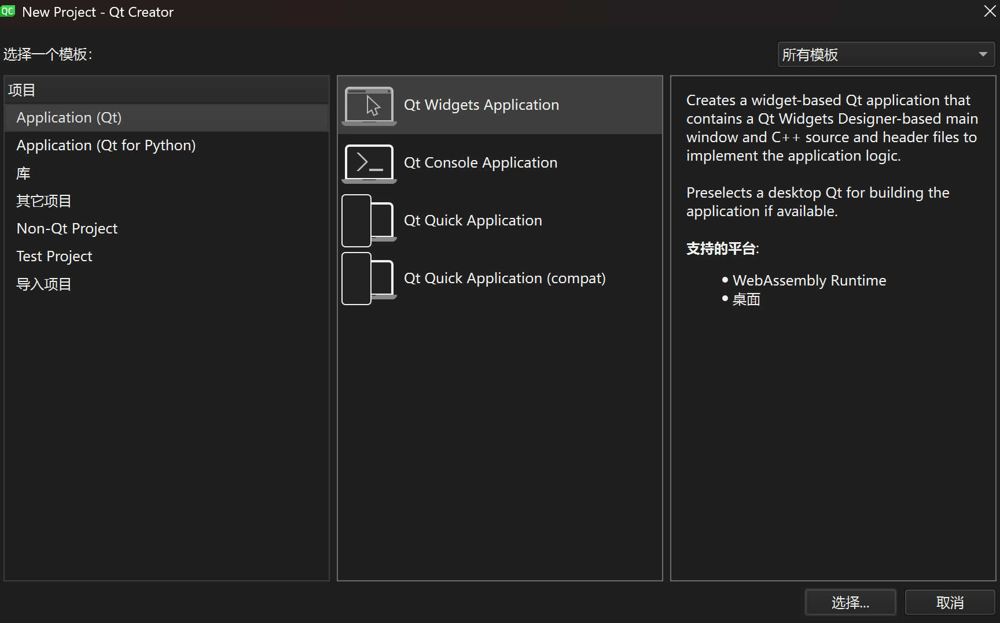

2.点击`选择`


3.点击`下一步`

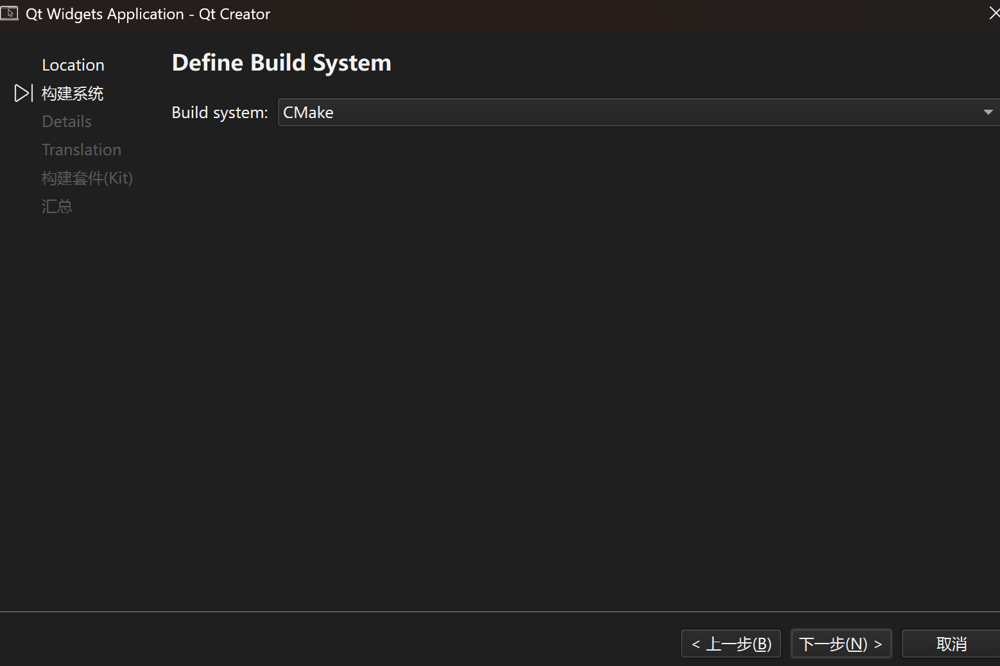

4.点击`下一步`

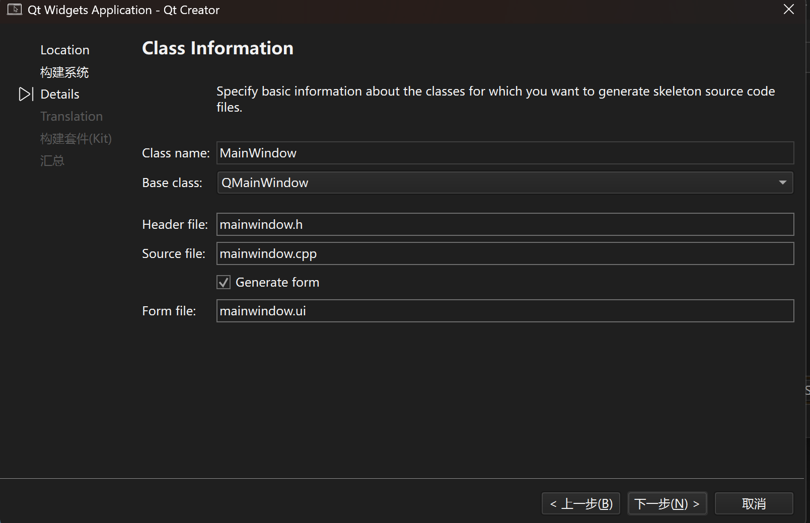

5.点击`下一步`


6.点击`下一步`


7.选择与您系统环境相同的编译器(可以多选)

例如：您是`Amd64位`，就不能选择`Android`或`Arm64`。


8.点击`下一步`。


9.点击`完成`。


正常情况下，侧边栏应该有很多文件。如果您和我一样，请继续。

如果您的侧边栏只有一个`CMakeLists.txt`文件，请跳转到[这里](#help)

## 编写hello_world

将`main.cpp`文件修改为

```cpp
#include <QApplication>
#include <QMainWindow>
#include <QPushButton>
int main(int argc, char* argv[])
{
	QApplication a(argc, argv);
	QMainWindow w;
	QPushButton b(&w);
	b.setText("Hello QT!");
	w.show();
	return a.exec();
}
```

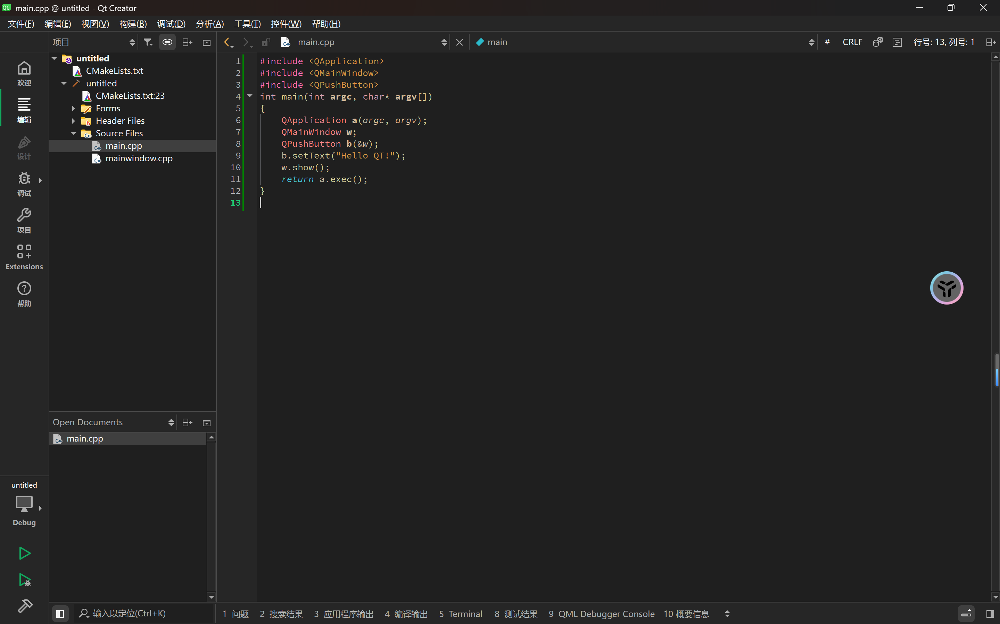

点击侧边栏倒数第三行的绿色三角运行。

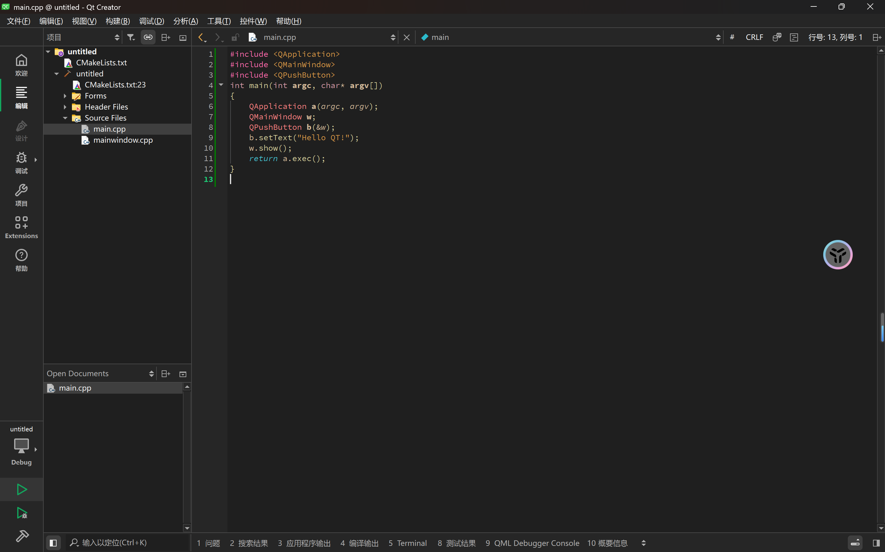

等待输出。


或者使用release，点击小电脑图标，切换到release生成


再次编译运行

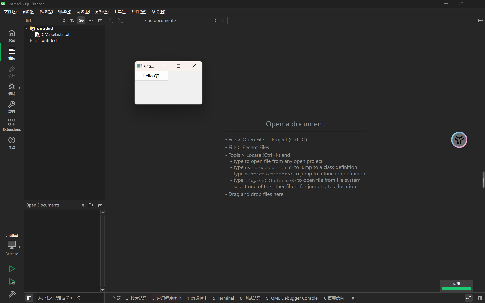

我们发现，不管是哪种编译方式，直接在文件夹打开，会出现以下情况。

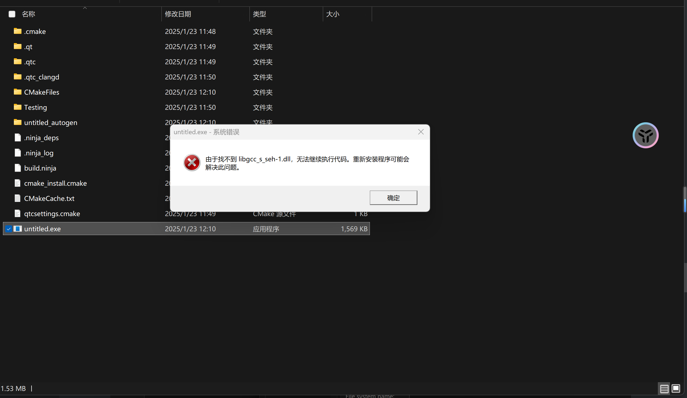

我们来到应用列表。

```bat
C:\Users\Lenovo\AppData\Roaming\Microsoft\Windows\Start Menu\Programs\Qt
```

找到对应编译器。


点开Qt开头的程序。


切换到文件目录。

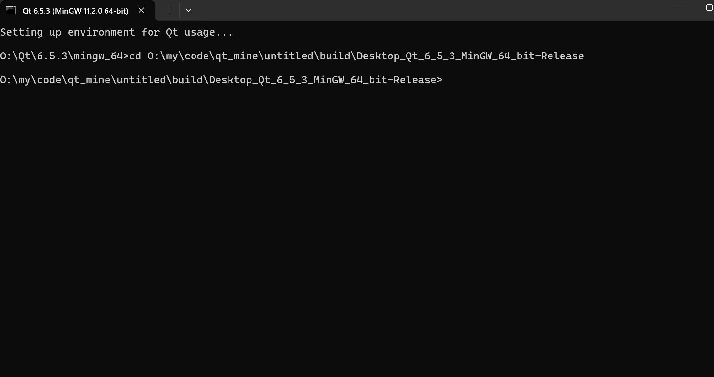

输入

```bat
windeployqt 文件名.exe
```

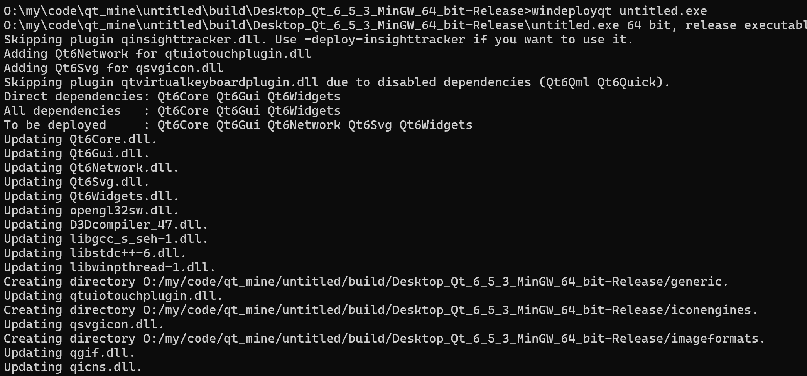

这样目录中就多了很多文件。


这次再打开文件。

就可以了。


# help

如果侧边栏只有一个文件，请点击窗口顶部的编辑中的`preference`

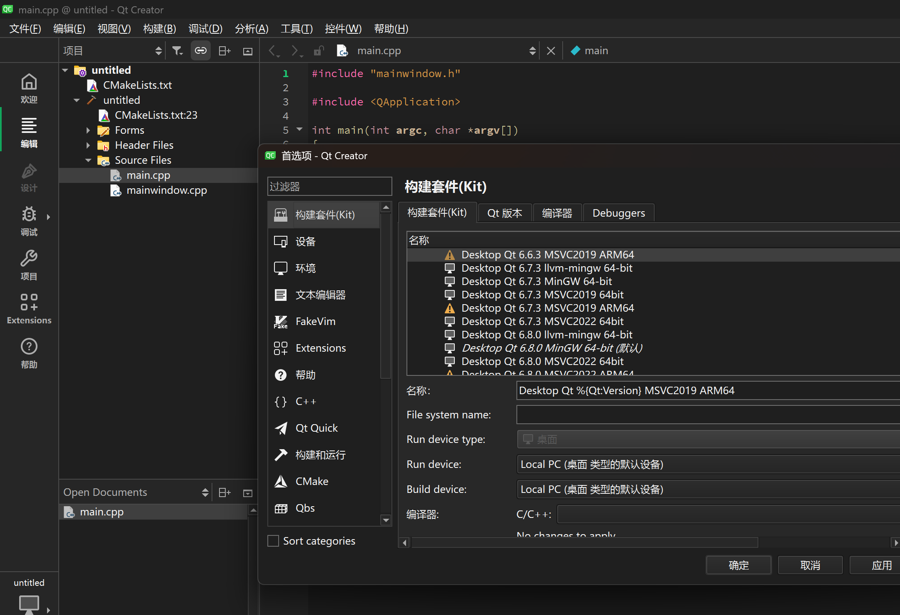

请点击所选编译器，并更改配置与我一样。

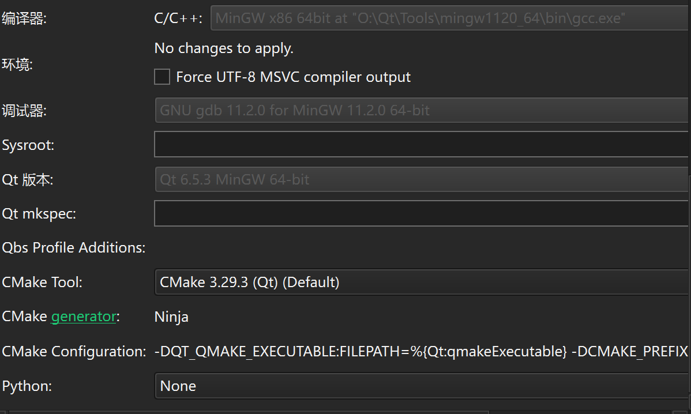

然后再去系统环境变量，将cmake添加到环境变量中。


点击`path`


点击`添加`

添加

``` bat
Qt安装路径\Tools\CMake_64\bin
```

点击`确定`并重启Qt。

如果还是不行，请跳转到创建文件的第4步左右，并把`cmake`改为`qmake`即可。